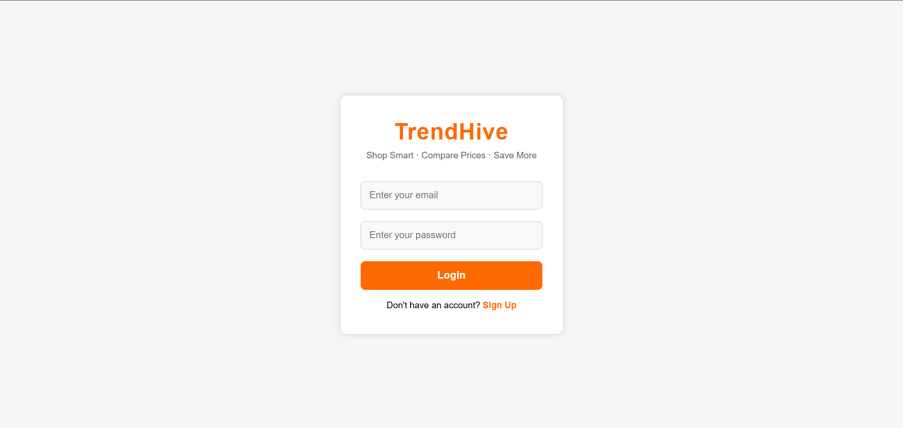
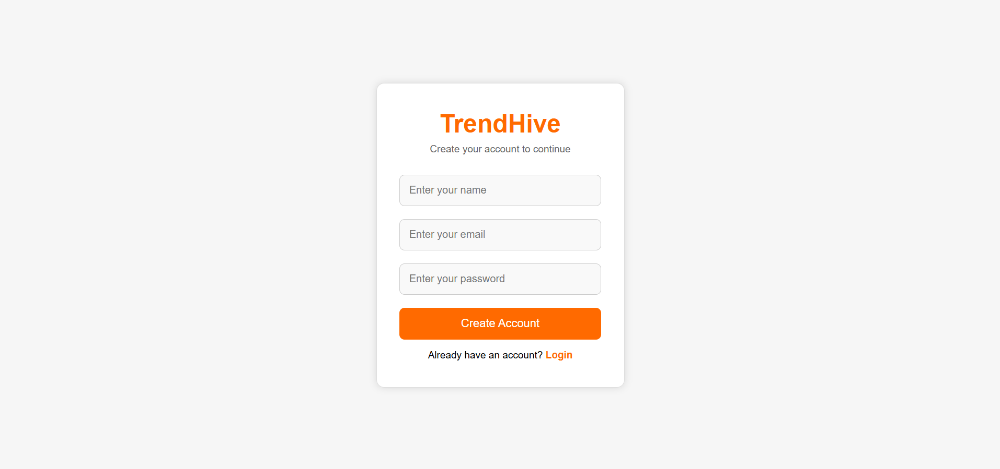
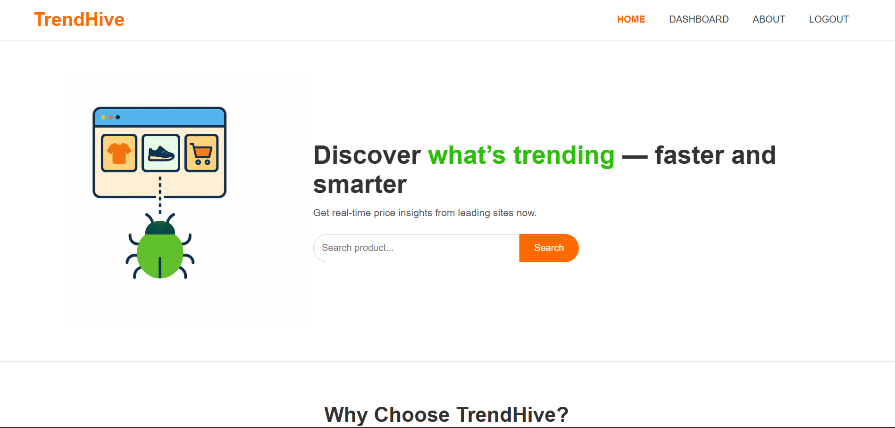
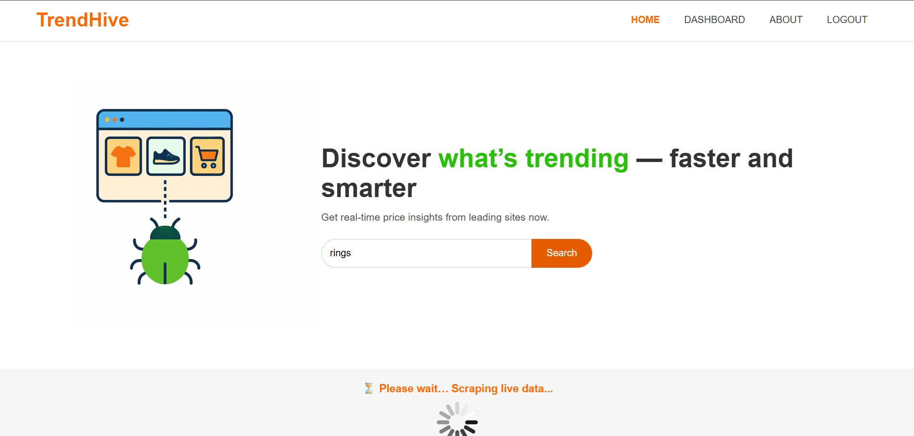
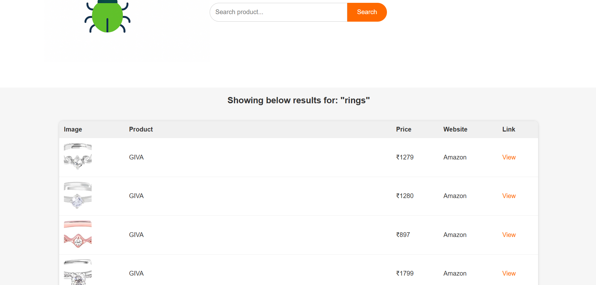
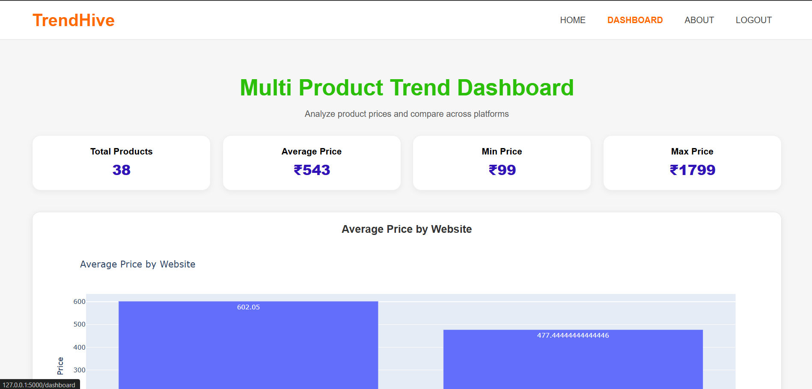
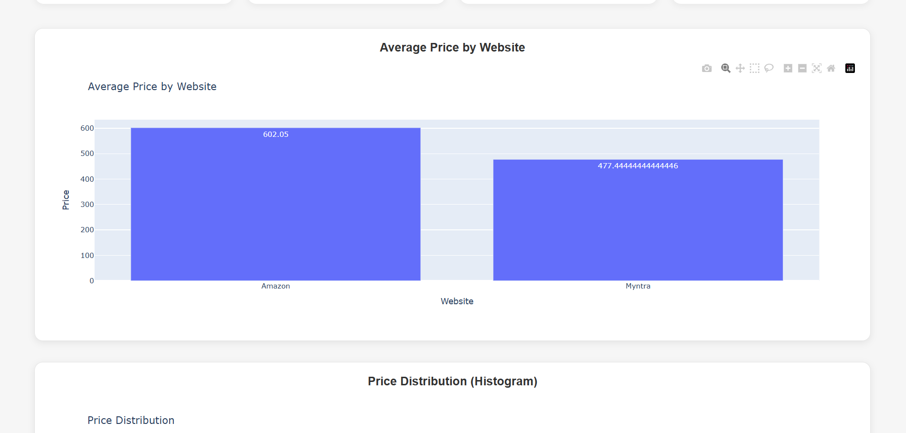
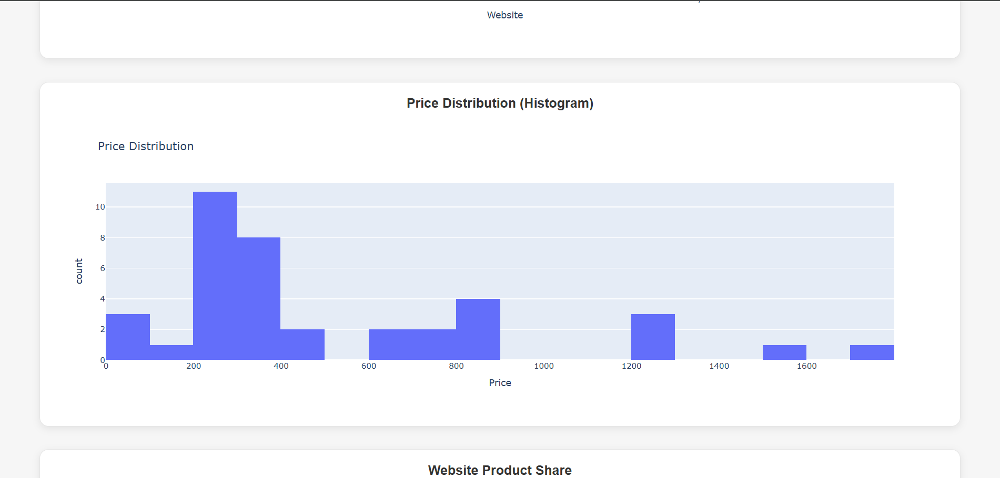
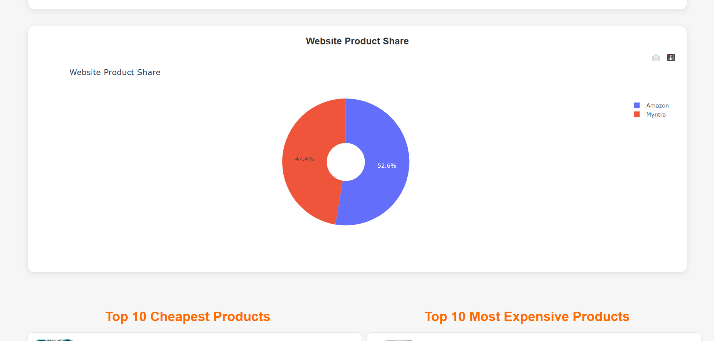
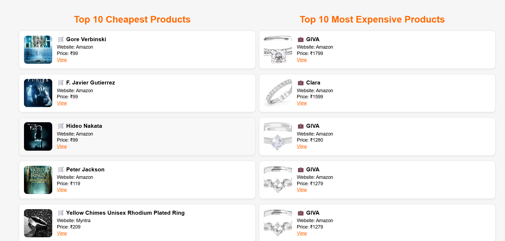

# TrendHive – Real-Time Product Price Comparison Platform

TrendHive is a real-time product price comparison and analysis platform that allows users to search any product, compare prices from Amazon & Myntra, and visualize trend insights through interactive dashboards.

---

## 📸 Platform Screenshots

### Login Page


### Signup Page


### Home Page


### Product Search


### Search Results


### Dashboard Overview


### Average Price Comparison


### Price Distribution (Histogram)


### Website Share (Pie Chart)


### Cheapest & Most Expensive Products


---

## ✨ Features

- Live Selenium web scraping  
- Compare prices from Amazon and Myntra  
- Clean product table with direct buy links  
- Interactive dashboard with charts  
- Histogram, Pie chart, Bar chart analytics  
- CSV-based data storage  
- User login & signup authentication  
- Flask backend for routing and processing  

---

## 🛠 Tech Stack

### Frontend
- HTML  
- CSS  
- Bootstrap  
- JavaScript  

### Backend
- Python Flask  
- Selenium  
- Pandas  
- Matplotlib  
- MySQL  

### Data
- CSV  
- Pandas  
- NumPy  

---

## 📄 Prerequisites

- Python 3.8+  
- Google Chrome  
- Correct ChromeDriver version  
- MySQL Server  
- pip  

---

## 🚀 Installation & Setup

### 1. Clone the Repository

```bash
git clone https://github.com/Tanvi166/trendhive.git
cd trendhive
```

### 2. Backend Setup

#### Install Python Dependencies
```bash
pip install -r requirements.txt
```

#### Optional: Environment Variables
Create `.env` file:
```env
MYSQL_HOST=localhost
MYSQL_USER=root
MYSQL_PASSWORD=yourpassword
MYSQL_DB=trendhive
```

#### Start Backend Server
```bash
python app.py
```

Server will run at:
```
http://localhost:5000
```

---

## 📁 Project Structure

```
TrendHive/
│
├── static/
│   ├── images/
│   │   ├── login.png
│   │   ├── signup.png
│   │   ├── home.png
│   │   ├── search.png
│   │   ├── search_results.png
│   │   ├── dashboard.png
│   │   ├── graph1_avg_price.png
│   │   ├── graph2_distribution.png
│   │   ├── graph3_share.png
│   │   ├── cheapest_expensive.png
│   │
│   ├── css/
│   └── js/
│
├── templates/
│   ├── login.html
│   ├── signup.html
│   ├── index.html
│   ├── results.html
│   └── dashboard.html
│
├── scraper.py
├── app.py
├── requirements.txt
└── README.md
```

---

## 📘 Usage Guide

1. Login or Signup  
2. Search any product  
3. Compare Amazon & Myntra prices  
4. View product images, prices, links  
5. Open Dashboard for insights  
   - Average price comparison  
   - Price distribution  
   - Website product share  
   - Cheapest + Most expensive items  

---

## 🐛 Troubleshooting

### ChromeDriver error  
Install manager:
```bash
pip install webdriver-manager
```

### Missing Modules
```bash
pip install -r requirements.txt --upgrade
```

### MySQL connection error  
- Start MySQL server  
- Check username/password  
- Verify `.env`  

---

## 📊 Data Sources

- Amazon live scraped data  
- Myntra live scraped data  
- Stored CSV files  

---

## 🤝 Contributing

Pull requests are welcome.

---


## 👩‍💻 Team

Developed by **Tanvi, Sanchi, Yashsavi**  
TrendHive · 2025
